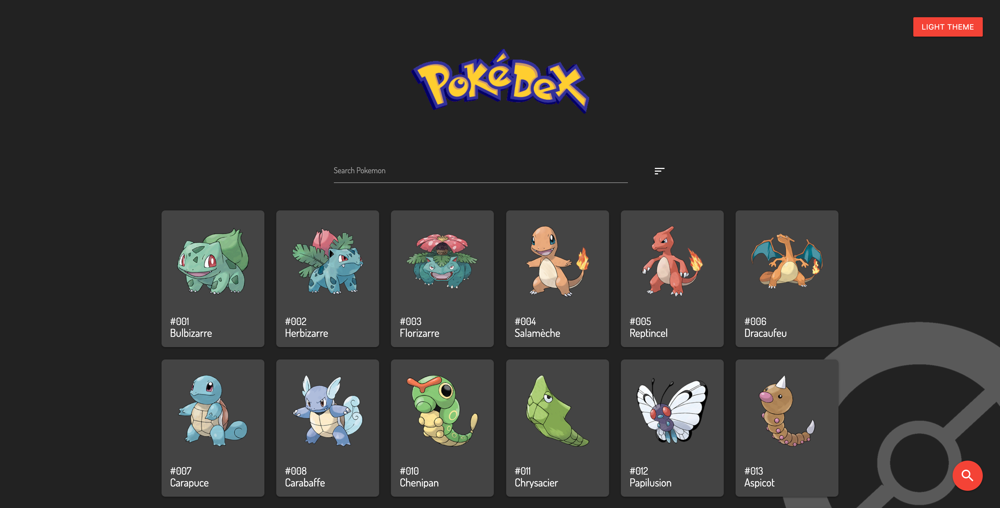
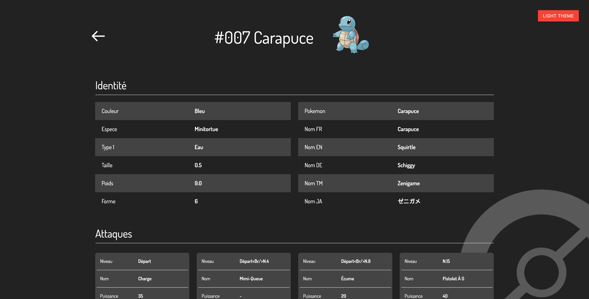

## Hello, FP

## <a name='TOC'>🐼 Summary</a>

- [Rules](#rules)
- [Overview](#overview)
- [Exercises](#exercises)
- [Credits](#credits)

## <a name='overview'>🦊 Rules</a>

Hi, here are some rules to carry out this story oav;

- You **MUST** create a git repository named `cx-react-pokemon`
- You **MUST** create a file called `.author` with your members firstnames and lastnames followed by a newline.

```sh
~/cx-react-pokemon ❯❯❯ cat -e .author
Majdi Toumi$
Dylan De Sousa$
```

> Of course, you can talk about the subject with other developers, peer-learning is
> the key to be a better developer. Don't hesitate to ask questions or help people on Teams.

> Don't forget, there is no useless question :-)

- You **MUST** return the project before Sunday December, 6 at 23:42
- You **MUST** add `pu-erh` user as a collaborator.
- YOU **MUST** define all functions signature by yourself :)

## <a name='overview'>🐱 Overview</a>

The purpose of theses exercises is simple, manipulate and display pokemons.

## <a name='steps'>🐨 Steps</a>

### 00 Prélude

The purpose is to create a simple API using [**express**](https://expressjs.com/fr/) and a showcase app using **React.js**

## The server

Create a directory call `server` on the `cx-react-pokemon` directory

### 01 Bonjour, Pokémon

You **MUST USE** [**pokedex.json**](./pokedex.json) data to fill a Postgres Database by using [**Knex**](http://knexjs.org/)<br />
Feel free to architect your database and table as you want.

> Tips, create a node file that did it and use package.json "script" to call it.

### 02 Bootstrap an API

Create a node js server that listen on a port define in args

Ex:
```sh
~/cx-react-pokemon/server ❯❯❯ node server.js 4242
Server is listening on http://localhost:4242
```

### 03 CRUD Pokemon

We'll allow to Create (POST), Update (PUT) or Delete a pokemon. But also to Read (GET) all or one pokemon,
Our application should have the following routes:

- `GET /pokemons` - this should respond with a list of all pokemons.
- `GET /pokemons/:id` - this route should display a single pokemon's found on your daily pokedex.json
- `POST /pokemons` - this route should add a new pokemon on your pokedex.
- `DELETE /pokemons/:id` - this route should allow you to delete a specific pokemon

Ex of one pokemon from Pokedex :

```json
    "id": 1,
    "name": {
      "english": "Bulbasaur",
      "japanese": "フシギダネ",
      "chinese": "妙蛙种子",
      "french": "Bulbizarre"
    },
    "type": [
      "Grass",
      "Poison"
    ],
    "base": {
      "HP": 45,
      "Attack": 49,
      "Defense": 49,
      "Sp. Attack": 65,
      "Sp. Defense": 65,
      "Speed": 45
    }
    ...
```

> For POST you must fill the fields: `name` and `type`

### 04 Postman discovery

Now that your API server is set, let's play with your API using [**Postman**](https://www.postman.com/collection/)

> You can also use `curl` or your browser

## The client

### 01 Yo, ui

Well, let's visuzalize pokemons datas and interact with your APIs !<br />

You **MUST** initialize your client using [**create react app**](https://fr.reactjs.org/docs/create-a-new-react-app.html#create-react-app) command.
The purpose is to display all pokemons from API, show one pokemon details and create a new one.

The directory must be `client`

> In this part, no rules, the purpose is to use basic stuff that you learn from React to create a sexy app.

### Images

You can display pokemon image using the url `https://assets.pokemon.com/assets/cms2/img/pokedex/detail/$NDEX.png`

> You haveto replace `$NDEX` by the index of a real pokemon, example [here](https://assets.pokemon.com/assets/cms2/img/pokedex/detail/001.png)

### Demos

Example of an application screen:

<p align="center">
  
</p>

<p align="center">
  
</p>

## 02 Bonuses

We love bonuses, so feel free to add anything you want, example:
- Query parameters search on API side
- Dark Theme
- ...

## <a name='credits'>🐵 Credits</a>

Craft with :heart: in **Paris**.
